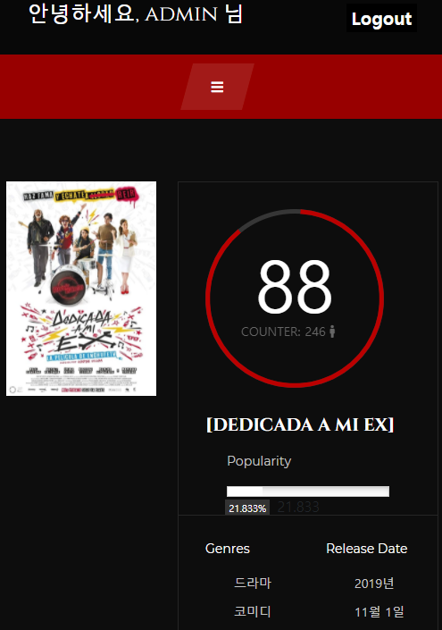

# Movie community

`Do it! 장고+부트스트랩 파이썬 웹 개발의 정석`


[toc]


## 1. 목표 서비스 구현 및 실제 구현 정도

* 영화 커뮤니티 서비스 구현
* Django를 활용한 서비스 설계
* 교재로 공부한 내용을 정리하자
* 부족한 부분
  * 반응형 웹 디자인
  * forms.py의 custom
  * html 시멘틱 태그, css display


## 2. 데이터베이스 모델링

* 영화 관련: Movie, Genre

* 사용자 관련: User
* 리뷰 관련: Review, Comment
* N:M관계: 영화 좋아요, 리뷰 좋아요, 팔로우


## 3. 필수 기능에 대한 설명

### (1) 개발환경

* python
  * Python 3.8.5
  * Django 3.2.1
* javascript
  * ECMA5 +

* database
  * sqlite3

### (2) 폴더 구조

```
movie-community
├── README.md
├── _README.assets
├── .gitignore
├── final.bmpr
│
├── _final
│   ├── _accounts
│   │   ├── admin.py
│   │   ├── apps.py
│   │   ├── forms.py
│   │   ├── migrations
│   │   ├── models.py
│   │   ├── templates
│   │   │   └── account
│   │   │       ├── _follow.html
│   │   │       ├── change_password.html
│   │   │       ├── login.html
│   │   │       ├── no_recommendations.html
│   │   │       ├── profile.html
│   │   │       ├── recommended.html
│   │   │       ├── signup.html
│   │   │       └── update.html
│   │   ├── tests.py
│   │   ├── urls.py
│   │   └── views.py
│   │
│   ├── _community
│   │   ├── admin.py
│   │   ├── apps.py
│   │   ├── forms.py
│   │   ├── migrations
│   │   ├── models.py
│   │   ├── templates
│   │   │   └── account
│   │   │       ├── create.html
│   │   │       ├── detail.html
│   │   │       ├── index.html
│   │   │       └── update.html
│   │   ├── tests.py
│   │   ├── urls.py
│   │   └── views.py
│   │
│   ├── _final
│   │   ├── templates
│   │   │   └── account
│   │   │       ├── create.html
│   │   │       ├── detail.html
│   │   │       ├── index.html
│   │   │       └── update.html
│   │   ├── urls.py
│   │   ├── __init__.py
│   │   ├── asgi.py
│   │   ├── settings.py
│   │   ├── urls.py
│   │   ├── wsgi.py
│   │
│   ├── _main
│   │   ├── admin.py
│   │   ├── apps.py
│   │   ├── forms.py
│   │   ├── migrations
│   │   ├── models.py
│   │   ├── templates
│   │   │   └── account
│   │   │       ├── create.html
│   │   │       ├── detail.html
│   │   │       ├── index.html
│   │   │       └── update.html
│   │   ├── tests.py
│   │   ├── urls.py
│   │   └── views.py
│   │
│   ├── _movies
│   │   ├── .fixtures
│   │   │   └── .movies
│   │   │       ├── movies.json
│   │   ├── admin.py
│   │   ├── apps.py
│   │   ├── forms.py
│   │   ├── migrations
│   │   ├── models.py
│   │   ├── templates
│   │   │   └── account
│   │   │       ├── create.html
│   │   │       ├── detail.html
│   │   │       ├── index.html
│   │   │       └── update.html
│   │   ├── tests.py
│   │   ├── urls.py
│   │   └── views.py
│   │
│   ├── _static
│   │   ├── css
│   │   ├── fonts
│   │   ├── img
│   │   ├── js
│
│   ├── db.sqlite3
│   ├── manage.py
│   └── requirements.txt
```

### (3) 상세 기능

```bash
터미널 작동 순서

$ python -m venv venv
$ source venv/scripts/activate
$ pip install -r requirements.txt

$ python manage.py makemigrations
$ python manage.py migrate
$ python manage.py loaddata movies/movies.json
$ python manage.py seed accounts --number=<생성할 더미 데이터 개수>
$ python manage.py seed community --number=<생성할 더미 데이터 개수>

$ python manage.py createsuperuser
$ python manage.py runserver
```


* 메인 페이지


 		좋아요가 많은 상위 10개 영화와 리뷰가 노출됩니다

```python
# final/main/views.py

from django.shortcuts import render
from django.views.decorators.http import require_safe

# 상위 폴더에 접근하는 방법
import sys, os
sys.path.append(os.path.dirname(os.path.abspath(os.path.dirname(__file__))))
from movies import models as a

sys.path.append(os.path.dirname(os.path.abspath(os.path.dirname(__file__))))
from community import models as b

@require_safe
def index(request):
    # 좋아요가 많은 상위 5개 영화만 보낼거야
    movies = a.Movie.objects.order_by('-like_users')
    only_movies = []
    for movie in movies:
        if movie not in only_movies:
            only_movies.append(movie)
            if len(only_movies) == 10:
                break
    
    # 좋아요가 많은 상위 5개 리뷰만 보낼거야
    reviews = b.Review.objects.order_by('-like_users')
    only_reviews = []
    for review in reviews:
        if review not in only_reviews:
            only_reviews.append(review)
            if len(only_reviews) == 10:
                break

    context = {
        'movies': only_movies,
        'reviews': only_reviews
    }

    return render(request, 'main/index.html', context)
```


* 영화 페이지


* 영화를 클릭하면 영화에 대한 리뷰 목록이 나옵니다
* 영화에 좋아요를 할 수 있습니다


```python
@require_safe
def detail(request, movie_pk):
    movie = get_object_or_404(Movie, pk=movie_pk)
    reviews = movie.review_set.all()

    # tmdb의 10점 만점 기준의 점수를
    # 100점 기준으로 환산해서 소수점 없애기
    percentage = int(movie.vote_average * 10)

    context = {
        'movie': movie,
        'reviews': reviews,
        'percentage': percentage,
    }
    return render(request, 'movies/detail.html', context)
```


* 영화 리뷰 페이지
  * 영화 정보가 나옵니다
  * 리뷰에 좋아요를 할 수 있습니다
  * 댓글을 달 수 있습니다


* 내가 좋아한 영화 중에서 랜덤으로 하나를 골라, TMDB의 추천 API로 전송합니다


* 프로필 페이지
  * 다른 유저의 아이디를 누르면 프로필 페이지로 이동합니다
  * 팔로우를 할 수 있습니다
  * 본인의 페이지에는 팔로우 버튼이 없습니다
  * 본인의 페이지에는 수정과 삭제 버튼이 있습니다


## 5. URL

* 메인 화면
  * http://127.0.0.1:8000/
* 관리자 화면
  * http://127.0.0.1:8000/admin
* 계정 관리 화면
  * http://127.0.0.1:8000/accounts
* 영화 관련 화면
  * http://127.0.0.1:8000/movies/
* 커뮤니티 관련 화면
  * http://127.0.0.1:8000/community


## 6. 느낀 점

### (1) 구현 못한 부분
 * 영화 이미지


```html
<!-- movies/templates/movies/index.html -->

<!-- 영화 포스터 사이즈를 마음대로 바꾸지 못함 -->
<div class="lp-pic" style="background-image: url({{movie.poster_path}});"></div>
```


* 추천 영화 페이지에서 이미지가 안나옴

  * ```python
    <!-- accounts/templates/accounts/recommended.html -->
    
    
    ```


* 반응형 웹
  * 화면 사이즈를 바꿔도 오른쪽 컴포넌트가 아래로 내려가지 않는 문제 발생



* forms.py custom
  * forms.py를 수정하지 않아서 테마가 적용되지 않았다


### (2) 어려웠던 부분

* 추천 영화
  * 이미지가 나오지 않음
  * tmdb에서 null 값을 보내는 경우가 있음, 에러 발생


```python
# accounts/views.py

@login_required
def recommended(request, username):
    person = get_object_or_404(get_user_model(), username=username)
    random_movies = person.like_movies.all().order_by('?')
    
    # 좋아요한 영화가 있을 때
    if random_movies:
        random_movie = random_movies[0]

        api_key = '개인정보'
        api_url = f'https://api.themoviedb.org/3/movie/{random_movie.id}/recommendations?api_key={api_key}&language=en-US&page=1'
        response = requests.get(api_url)
        recommended_movies = response.json()
        
        # 추천 영화가 있을 때
        if 'results' in recommended_movies.keys():
            recommended_movies = recommended_movies['results']

            paginator = Paginator(recommended_movies, 3)
            page = request.GET.get('page')
            posts = paginator.get_page(page)

            context = {
                'posts': posts,
                'like_movie': random_movie,
            }
            return render(request, 'accounts/recommended.html', context)
        # 추천 영화가 없을 때
        else:
            return render(request, 'accounts/no_recommendations.html')
    
    # 좋아요한 영화가 없을 때
    else:
        return render(request, 'accounts/recommended.html')
```


* 상위 폴더에 있는 파이썬 파일을 import 하기

  ```python
  import sys, os
  sys.path.append(os.path.dirname(os.path.abspath(os.path.dirname(__file__))))
  from movies import models as a
  ```

  

* 외래키로 연결했다면 forms.py에 칼럼을 추가해야 한다

  ```python
  # community/models.py
  class Review(models.Model):
      movie = models.ForeignKey(a.Movie, on_delete=models.CASCADE)
      
  # community/forms.py
  class ReviewForm(forms.ModelForm):
      class Meta:
          model = Review
          fields = ['title', 'movie', 'rank', 'content']
  ```

  

* 정적 파일 가져오기

  ```python
  # final/settings.py
  STATIC_URL = '/static/'
  STATICFILES_DIRS = [os.path.join(BASE_DIR, 'static'),]
  
  # final/urls.py
  urlpatterns += static(settings.STATIC_URL, document_root=settings.STATIC_ROOT)
  ```

  ```html
  <!-- final/templates/base.html -->
  
  
  <link rel="stylesheet" href="" type="text/css">
  ```

  